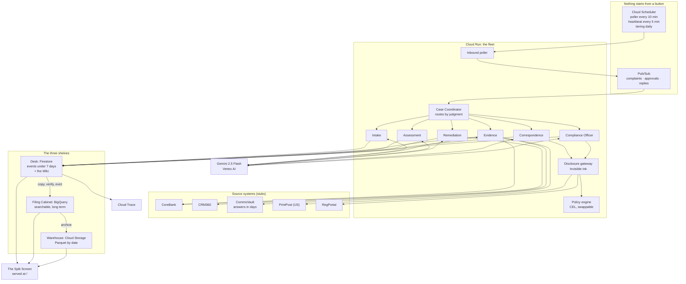
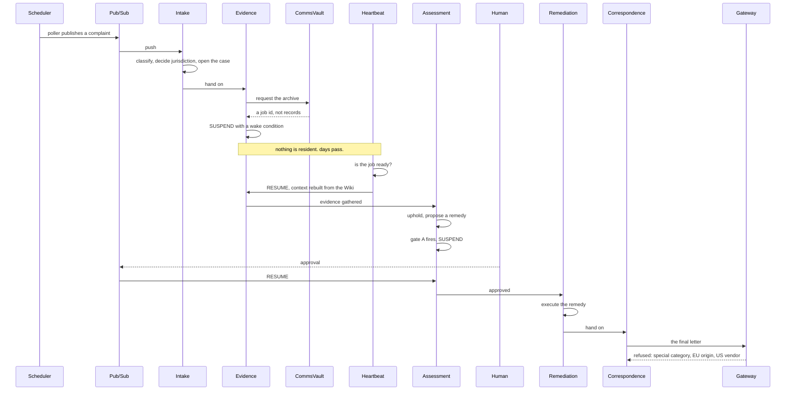

# How BLACKBOX is put together

Six agents doing regulated work, on top of a recording layer that cannot be
edited. Everything below runs on Google Cloud, and every model call goes to
Gemini on Vertex AI.

## The whole system

## The two things people confuse

They are separate on purpose, and keeping them separate is what makes the system
work at scale.

| | The Diary (Flight Recorder) | The Wiki (memory) |
|---|---|---|
| What it is | Raw, append-only record of everything | Clean, current, condensed summaries |
| Changes | Never. Append only. | Yes, rewritten as facts change |
| Who reads it | The replay engine and auditors | The agents, during normal work |
| Where it lives | Firestore, then BigQuery, then Cloud Storage | Firestore only, small |
| Grows forever | Yes, but tiered off the hot path | No |

**Agents read the Wiki. Agents never read the Diary during normal operation.** A
fleet that rebuilt context from raw events would feel fine in a demo and be
unusable in month nine, because the log grows without bound and a Wiki page does
not.

## How a case moves

That refusal at the end is the point. The letter contains no medical word. It is
restricted because of where its content came from, which is something no keyword
filter can see.

## Where each phase lives

| Phase | Module | What it holds |
|---|---|---|
| 1 Flight Recorder | `schema.py`, `event_store.py`, `backends.py`, `fold.py` | The event schema, the one write method, state computed not stored |
| 1.5 Wiki and shelves | `wiki.py`, `wiki_store.py`, `shelves.py`, `tiering.py` | Derived memory, and copy-verify-evict tiering |
| 2 One agent | `agents/intake_*.py`, `stubs/`, `main.py` | The Intake Agent, the source systems, the service |
| 3 The fleet | `agents/fleet*.py`, `wake.py`, `heartbeat.py`, `approvals.py` | Five more agents, suspend and resume, the beat |
| 4 Invisible Ink | `labels.py`, `propagation.py`, `gateway.py`, `taint.py` | The lattice, propagation, exit checks, the trail |
| 5 The Eraser | `eraser.py`, `regions.py` | Transitive cascade, regeneration, region pinning |
| 6 Time Machine | `policy.py`, `timemachine.py`, `divergence.py`, `replay.py` | Policies as data, state as-of, fixtures, divergence |
| 7 Stunt Double | `stunt.py`, `shadow_service.py` | Shadow isolation, the judge, the promotion gate |
| 8 Immune System | `immune.py`, `redteam.py`, `immune_service.py` | Boundary criteria, generated attacks, the corpus |
| 9 Crash Test | `faults.py`, `degradation.py` | Faults the agents see, degradation scoring |
| 10 Split Screen | `ui.py` | One self-contained page, six live views |

## Guarantees, and where they are held

**Append only.** `EventStore` has one write method and no update or delete.
Firestore writes go through `create()`, not `set()`, so an overwrite fails at the
database rather than succeeding quietly. Tiering can move an event between
shelves, but only after reading it back and confirming it arrived intact.

**Causally complete.** Every case has exactly one root event and no orphans.
`Recorder.assert_causally_complete()` checks it, tests assert it, and
`/cases/{id}/trace` reports it. Null `caused_by` would make the Time Machine
impossible later, so it is checked rather than hoped for.

**Nothing runs from a button.** Work begins when a message lands on a Pub/Sub
topic. The scheduler wakes a poller; the poller publishes; the push subscription
runs an agent.

**A replay cannot touch production.** It runs against a fixture object with no
clients in it, and a missing recording stops the replay rather than falling
through to a live call.

**Gemini only.** The model id lives in one place, `config.gemini_model`. Nothing
else in the codebase names a model.

## What is deployed, and what is not

Deployed and running on Cloud Run: the fleet, the poller, the heartbeat, the
tiering job, the gateway, the policy engine, the Split Screen.

Not automated: the red team campaign and the shadow runs have endpoints but no
scheduler job, because both cost model calls and neither needs to run unattended
to be demonstrated. The attack corpus persists to the instance filesystem, which
Cloud Run does not keep between revisions.
